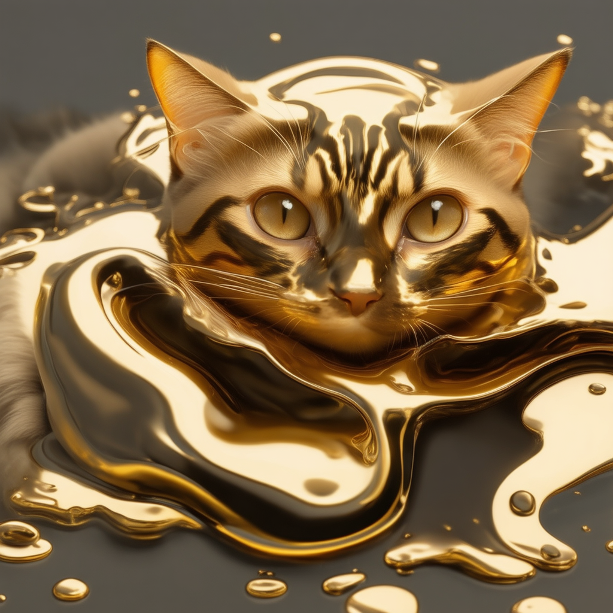

# rf-inversion-sd3
[Unofficial] [RF Inversion](https://rf-inversion.github.io/) implemented for [Stable Diffusion 3](https://huggingface.co/docs/diffusers/main/en/api/pipelines/stable_diffusion/stable_diffusion_3) (Also compatible with 3.5)

## Example 

### Image Editing 

```
python sd3_rf_inversion.py --image_path="images/dog.jpg" --prompt="Photograph of a cat on the grass"
```

| Source Image,  source_prompt: "" | **prompt:** Photograph of a cat on the grass |
| ---- | ----- |
|    |  |

### Style Transfer

Provide addition `--source_prompt` to describe the style that want to transfer while `--eta_base` is describe how much detail of the source image to keep (0.0 - 1.0) and `--eta_trend=linear_decrease` is make image less look like source image when keep denosing. Note that you might need to include "in the style of <source_prompt>" to your final prompt to produce the image that have closer style.

```
python sd3_rf_inversion.py --image_path="images/gold.jpg"  --prompt "a cat in the style of 3d melting gold render" --source_prompt "3d melting gold render" --eta_trend linear_decrease --eta_base 0.9
```

| Source Image, source_prompt: "3d melting gold render" | prompt: "a cat in the style of 3d melting gold render" |
| ---- | ----- |
|    |  |


## Getting started 

Simply call the sd3_rf_inversionl.py

```
python sd3_rf_inversion.py
```

This code have a few option that you can tuning around 

```
options:
  -h, --help            show this help message and exit
  --model_path MODEL_PATH
                        Path to the pretrained model
  --image_path IMAGE_PATH
                        Path to the input image
  --output_dir OUTPUT_DIR
                        Directory to save output images
  --eta_base ETA_BASE   Eta parameter for interpolated_denoise
  --eta_trend {constant,linear_increase,linear_decrease}
                        Eta trend for interpolated_denoise
  --start_step START_STEP
                        Start step for eta values, 0-based indexing, closed interval
  --end_step END_STEP   End step for eta values, 0-based indexing, open interval
  --no_inversion        Skip the inversion progress. Useful for comparing between with and without inversion
  --guidance_scale GUIDANCE_SCALE
                        Guidance scale for interpolated_denoise
  --num_steps NUM_STEPS
                        Number of steps for timesteps
  --seed SEED           seed for generation
  --gamma GAMMA         Gamma parameter for interpolated_inversion, describe how much influent of the source image 0.0 is not influence at all while 1.0 is exact match is the source image
  --prompt PROMPT       Prompt text for generation
  --source_prompt SOURCE_PROMPT
                        Prompt of the soruce image, leave blank for editing image or describe style that you want to transfer from source image
  --dtype {float16,bfloat16,float32}
                        Data type for computations
```

## Requirements 
This repository need diffusers 0.31.0 or newer


## Acknowledgements 
Some portion of code taken from [rf-inversion-diffuser](https://github.com/DarkMnDragon/rf-inversion-diffuser) which is design to run on Flux
