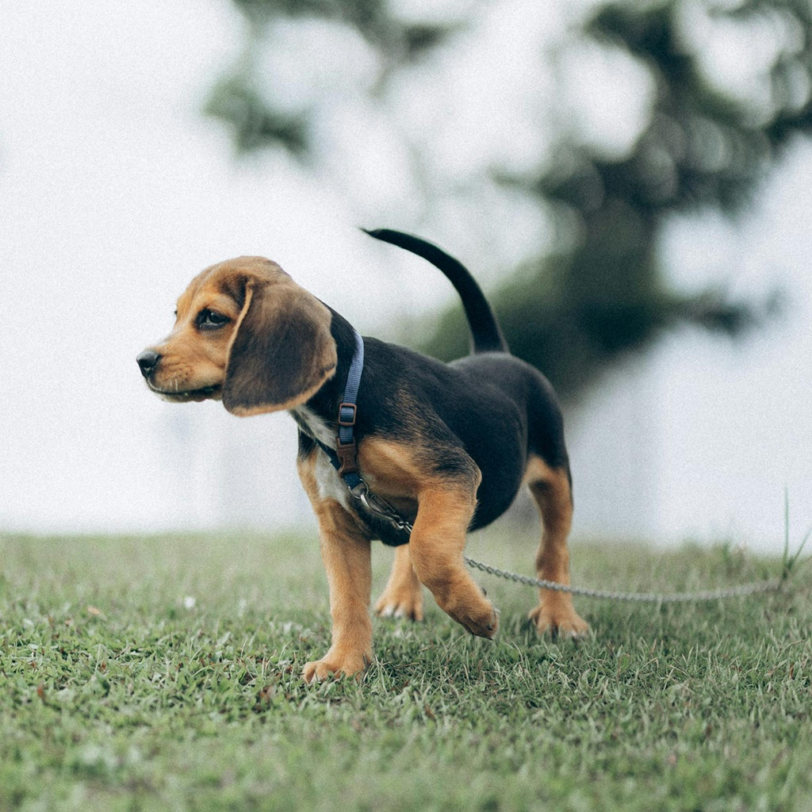
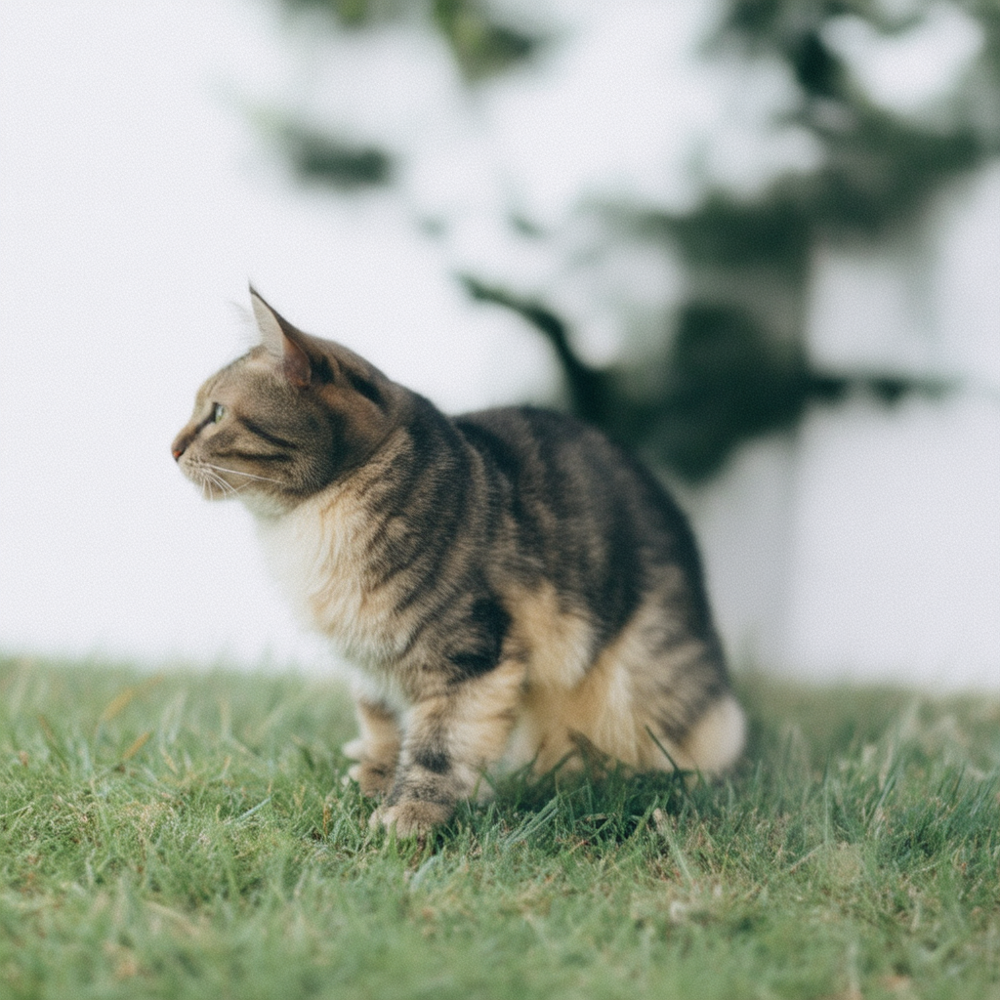

# rf-inversion-sd3
[Unofficial] RF Inversion implemented for Stable Diffusion 3 (Also compatible with 3.5)

| Source Image (Dog) | **Prompt:** Photograph of a cat on the grass |
| ---- | ----- |
|    |  |


## Getting started 

```
python sd3_rf_inversion.py
```


## Requirements 
This repository need diffusers 0.31.0 or newer


## Credit 
Some portion of code taken from [rf-inversion-diffuser](https://github.com/DarkMnDragon/rf-inversion-diffuser) which is design to run on Flux
